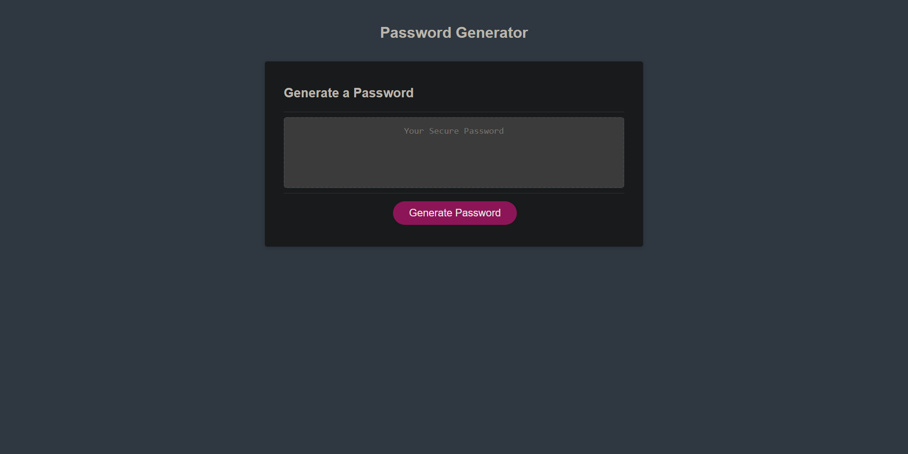

##Password Generator

SCREENSHOT OF WEBSITE: 

LINK TO WEBSITE:
https://keoughcatelin.github.io/password-generator/ 

This is a simple JavaScript application that generates a random password based on user preferences. The user can specify the desired length of the password (between 8 and 128 characters) and choose the types of characters to include (lowercase, uppercase, numeric, and special characters). The generated password is then displayed on the screen.

Getting Started
To use the password generator, simply open the index.html file in a web browser. The application will load, and you will see a "Generate Password" button.

Usage
Click the "Generate Password" button.
You will be prompted to enter the desired length of your password. Make sure to enter a number between 8 and 128.
You will then be asked to select the types of characters to include in the password. Choose whether to include lowercase, uppercase, numeric, and special characters by clicking "OK" or "Cancel" in the confirmation prompts.
Once you have made your selections, a random password will be generated and displayed in the text box.
If you're not satisfied with the generated password, you can click the "Generate Password" button again to generate a new one.
Please note that the generated passwords are randomly generated and do not guarantee security. It is always recommended to use strong, unique passwords and employ additional security measures when necessary.

License
This project is licensed under the MIT License.

Thank you for using the password generator!